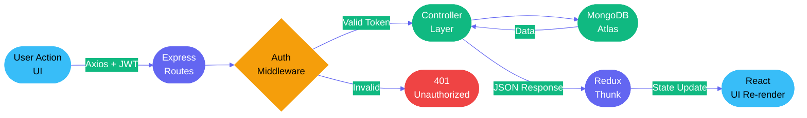

<div align="center">


<br>

[](https://github.com/mananjani2102/safarsathi)

<br>

<p align="center">
  <a href="https://safar-sathii.netlify.app">
    
  </a>
  &nbsp;
  
  &nbsp;
  
  &nbsp;
  
</p>

<br>


</div>

<br>

<div align="center">

## Live Services

| Service | Platform | URL |
|:-------:|:--------:|:----|
| Frontend | Netlify | https://safar-sathii.netlify.app |
| Backend API | Render | https://safarsathi-backend-0ndc.onrender.com |
| Database | MongoDB Atlas | Managed Cloud Cluster |

</div>

<br>

<div align="center">

</div>

<br>

<div align="center">

## The Problem with Existing Trip Planners

</div>

```
  x  Your itinerary lives in a notes app — disconnected from your budget
  x  Budget is tracked in a spreadsheet — disconnected from your schedule
  x  No single place to plan activities day by day with cost and timing
  x  You can't share the trip with others unless they have the same app
  x  No visual breakdown of where your money is actually going
  x  No way to search, filter, or sort your past and upcoming trips

  +  SafarSathi consolidates everything — plan, budget, track, and share
  +  Day-wise activity planner with category, time, location, and cost
  +  Visual budget donut chart with over-budget alerts in real time
  +  Public share links — no login required for the viewer
```

<br>

<div align="center">

<table>
<tr>
<td align="center" width="50%">

### Every Other Tool


</td>
<td align="center" width="50%">

### SafarSathi


</td>
</tr>
</table>

</div>

<br>

<div align="center">

</div>

<br>

<div align="center">

## Feature Showcase

</div>

<div align="center">
<table>
<tr>
<td align="center" width="25%">


### Trip Management
Create, view, edit, and delete trips with destination, date range, and total budget. All trips at one glance with status-based filtering.


</td>
<td align="center" width="25%">


### Day-wise Itinerary
Plan every day of your trip. Add activities with title, category, time, location, and cost per entry. Fully editable and deletable.


</td>
<td align="center" width="25%">


### Budget Tracker
Log every expense by category with date. Visual progress bar shows how close you are to the limit. Over-budget state triggers a red alert.


</td>
<td align="center" width="25%">


### Budget Donut Chart
Recharts-powered donut chart breaks spending by category visually. Know at a glance where your money went — food, hotel, transport, or activities.


</td>
</tr>
<tr>
<td align="center" width="25%">


### Public Trip Sharing
Generate a public read-only link for any trip. Anyone with the link can view your itinerary and budget — no login needed.


</td>
<td align="center" width="25%">


### Smart Search + Filter
Search trips by title or destination. Filter by status — upcoming, ongoing, or completed. Sort by date or budget in either direction.


</td>
<td align="center" width="25%">


### Pagination
Trip list is paginated at 6 per page with numbered navigation. Never lose track of a trip, no matter how many you create.


</td>
<td align="center" width="25%">


### Secure Auth
JWT-based register, login, and logout. All trip, activity, and expense routes are protected. No data is accessible without a valid token.


</td>
</tr>
</table>
</div>

<br>

<div align="center">

</div>

<br>

<div align="center">

---

### Debounce + Pagination — The UX Detail Others Skip

</div>

```
SafarSathi's search is built for performance, not just looks —

  Search Input Debounced at 500ms  ->  No API call fires on every keystroke
  Status Filter                    ->  upcoming | ongoing | completed
  Sort Modes                       ->  newest | oldest | budget_high | budget_low
  Pagination                       ->  6 trips per page with numbered controls

All four work together. Filter by status, sort by budget, paginate through results —
every combination works without a page reload. State is managed cleanly via Redux Toolkit.
```

<br>

<div align="center">

</div>

<br>

<div align="center">

## Tech Stack

### Frontend


<br><br>

<table>
<tr>
<th align="center">Layer</th>
<th align="center">Technology</th>
<th align="left">What it does in SafarSathi</th>
</tr>
<tr>
<td align="center"></td>
<td align="center"><strong>React 18 + Vite</strong></td>
<td>Component-based architecture with fast HMR and optimized production builds</td>
</tr>
<tr>
<td align="center"></td>
<td align="center"><strong>Redux Toolkit</strong></td>
<td>Global state for auth, trips, activities, and expenses via async thunks</td>
</tr>
<tr>
<td align="center"></td>
<td align="center"><strong>React Router DOM v6</strong></td>
<td>Protected routes, nested layouts, and declarative client-side navigation</td>
</tr>
<tr>
<td align="center"></td>
<td align="center"><strong>Tailwind CSS v3</strong></td>
<td>Utility-first responsive design with dark/light mode via CSS variables</td>
</tr>
<tr>
<td align="center"></td>
<td align="center"><strong>Recharts</strong></td>
<td>Donut chart for category-wise budget breakdown with responsive container</td>
</tr>
<tr>
<td align="center"></td>
<td align="center"><strong>Axios</strong></td>
<td>Centralized API client with JWT interceptor for authenticated requests</td>
</tr>
<tr>
<td align="center"></td>
<td align="center"><strong>react-hot-toast</strong></td>
<td>Success and error toast notifications for all user-facing actions</td>
</tr>
<tr>
<td align="center"></td>
<td align="center"><strong>lucide-react</strong></td>
<td>Consistent icon set across all UI components</td>
</tr>
</table>

<br>

### Backend


<br><br>

<table>
<tr>
<th align="center">Layer</th>
<th align="center">Technology</th>
<th align="left">What it does in SafarSathi</th>
</tr>
<tr>
<td align="center"></td>
<td align="center"><strong>Node.js + Express</strong></td>
<td>REST API server with modular route structure and global error handling middleware</td>
</tr>
<tr>
<td align="center"></td>
<td align="center"><strong>MongoDB + Mongoose</strong></td>
<td>Stores users, trips, activities, and expenses with typed schemas and validation</td>
</tr>
<tr>
<td align="center"></td>
<td align="center"><strong>JSON Web Tokens</strong></td>
<td>Stateless auth on all protected routes — verified via custom authMiddleware</td>
</tr>
<tr>
<td align="center"></td>
<td align="center"><strong>dotenv</strong></td>
<td>Environment variable management for port, DB URI, and JWT secret</td>
</tr>
</table>

</div>

<br>

<div align="center">

</div>

<br>

<div align="center">

## Data Flow Architecture



<br>


</div>

<br>

<div align="center">

</div>

<br>

<div align="center">

## Project Structure

</div>

```
safarsathi/
|
+-- backend/
|   +-- config/
|   |   +-- db.js                    <- MongoDB Atlas connection via Mongoose
|   |
|   +-- controllers/
|   |   +-- authController.js        <- Register | Login | Get Profile
|   |   +-- tripController.js        <- CRUD + Search | Filter | Sort | Paginate
|   |   +-- activityController.js    <- Activity CRUD per trip
|   |   +-- expenseController.js     <- Expense CRUD + category summary
|   |   +-- publicController.js      <- Read-only trip view by ID (no auth)
|   |
|   +-- middleware/
|   |   +-- authMiddleware.js        <- JWT decode and user injection
|   |   +-- errorMiddleware.js       <- Global error formatting
|   |
|   +-- models/
|   |   +-- User.js                  <- name | email | hashed password
|   |   +-- Trip.js                  <- title | destination | dates | budget | publicToken
|   |   +-- Activity.js              <- tripId | day | title | location | time | category | cost
|   |   +-- Expense.js               <- tripId | title | amount | category | date
|   |
|   +-- routes/
|   |   +-- authRoutes.js
|   |   +-- tripRoutes.js
|   |   +-- activityRoutes.js
|   |   +-- expenseRoutes.js
|   |   +-- publicRoutes.js
|   |   +-- index.js                 <- Mounts all route modules at /api
|   |
|   +-- server.js                    <- Express app bootstrap + MongoDB connect
|   +-- .env                         <- PORT | MONGO_URI | JWT_SECRET | NODE_ENV
|   +-- package.json
|
+-- frontend/
    +-- public/
    +-- src/
    |   +-- components/
    |   |   +-- Navbar.jsx            <- Top navigation with theme toggle
    |   |   +-- ProtectedRoute.jsx    <- Redirects unauthenticated users to /login
    |   |   +-- TripCard.jsx          <- Trip summary card with actions
    |   |   +-- Pagination.jsx        <- Numbered page controls
    |   |   +-- BudgetChart.jsx       <- Recharts donut by category
    |   |   +-- ActivityCard.jsx      <- Activity entry display + delete
    |   |   +-- ExpenseTable.jsx      <- Tabular expense list with totals
    |   |   +-- ConfirmModal.jsx      <- Reusable delete confirmation dialog
    |   |
    |   +-- context/
    |   |   +-- ThemeContext.jsx      <- Dark/light mode toggle + localStorage persist
    |   |
    |   +-- hooks/
    |   |   +-- useDebounce.js        <- 500ms debounce for search input
    |   |   +-- useScrollAnimation.jsx <- Scroll-triggered reveal animations
    |   |
    |   +-- pages/
    |   |   +-- Home.jsx              <- Landing page with hero and feature overview
    |   |   +-- Login.jsx             <- Login form with validation and JWT storage
    |   |   +-- Register.jsx          <- Registration form
    |   |   +-- Dashboard.jsx         <- Trip stats and recent activity overview
    |   |   +-- Trips.jsx             <- Full trip list with search/filter/sort/paginate
    |   |   +-- CreateTrip.jsx        <- New trip form with real-time validation
    |   |   +-- TripDetails.jsx       <- Itinerary + budget tracker for one trip
    |   |   +-- PublicTripView.jsx    <- Read-only trip page — no auth required
    |   |
    |   +-- redux/
    |   |   +-- store.js              <- Redux store configuration
    |   |   +-- authSlice.js          <- Login | logout | register thunks + state
    |   |   +-- tripSlice.js          <- Trip CRUD thunks + filter/search/sort state
    |   |   +-- activitySlice.js      <- Activity CRUD thunks
    |   |   +-- expenseSlice.js       <- Expense CRUD thunks + summary state
    |   |
    |   +-- services/
    |   |   +-- api.js                <- Axios instance with base URL + JWT interceptor
    |   |
    |   +-- App.jsx                   <- BrowserRouter + route declarations
    |   +-- main.jsx                  <- ReactDOM.createRoot entry
    |   +-- index.css                 <- Global styles + dark mode CSS variables
    |
    +-- tailwind.config.js
    +-- vite.config.js
    +-- package.json
```

<br>

<div align="center">

</div>

<br>

<div align="center">

## Getting Started

<table>
<tr>
<td>

```
+==================================================================+
|                                                                  |
|   +----------------------------------------------------------+   |
|   |  TERMINAL                                          . . . |   |
|   +----------------------------------------------------------+   |
|   |                                                          |   |
|   |  $ git clone github.com/mananjani2102/safarsathi         |   |
|   |  Cloning into 'safarsathi'... done.                      |   |
|   |                                                          |   |
|   |  $ cd safarsathi/backend && npm install                  |   |
|   |  added 94 packages in 6s                                 |   |
|   |                                                          |   |
|   |  $ cp .env.example .env                                  |   |
|   |  # paste your MONGO_URI and JWT_SECRET                   |   |
|   |                                                          |   |
|   |  $ npm run dev                                           |   |
|   |  + MongoDB connected                                     |   |
|   |  + Server running at http://localhost:5000               |   |
|   |                                                          |   |
|   |  $ cd ../frontend && npm install && npm run dev          |   |
|   |  + Frontend running at http://localhost:3000             |   |
|   |                                                          |   |
|   |  SafarSathi is live. Plan your next trip.                |   |
|   |                                                          |   |
|   +----------------------------------------------------------+   |
|                                                                  |
+==================================================================+
```

</td>
</tr>
</table>

</div>

### Prerequisites


### 1 — Clone

```bash
git clone https://github.com/mananjani2102/safarsathi.git
cd safarsathi
```

### 2 — Backend Setup

```bash
cd backend
npm install
```

Create `.env` inside the `backend` folder:

```env
PORT=5000
MONGO_URI=your_mongodb_atlas_connection_string
JWT_SECRET=your_jwt_secret_key
NODE_ENV=development
```

```bash
npm run dev    # -> http://localhost:5000
```

### 3 — Frontend Setup

```bash
cd ../frontend
npm install
```

Create `.env` inside the `frontend` folder:

```env
VITE_API_URL=http://localhost:5000/api
```

```bash
npm run dev    # -> http://localhost:3000
```

<br>

<div align="center">

</div>

<br>

<div align="center">

## Environment Variables

### Backend `.env`

| Variable | Required | Description |
|:---------|:--------:|:------------|
| `PORT` | Yes | HTTP port for Express server |
| `MONGO_URI` | Yes | MongoDB Atlas connection string |
| `JWT_SECRET` | Yes | Secret string used to sign and verify JWT tokens |
| `NODE_ENV` | Yes | `development` or `production` |

### Frontend `.env`

| Variable | Required | Description |
|:---------|:--------:|:------------|
| `VITE_API_URL` | Yes | Full backend API base URL ending in `/api` |

</div>

<br>

<div align="center">

</div>

<br>

<div align="center">

## API Reference


</div>

<br>

### Auth Routes — `/api/auth`

| Method | Endpoint | Description | Auth Required |
|:------:|:---------|:------------|:-------------:|
| `POST` | `/auth/register` | Register a new user | No |
| `POST` | `/auth/login` | Login and receive JWT token | No |
| `GET` | `/auth/profile` | Get authenticated user profile | Yes |

**Register Request:**
```json
{ "name": "Manan Jani", "email": "manan@example.com", "password": "password123" }
```

**Login Response:**
```json
{
  "token": "eyJhbGciOiJIUzI1NiIsInR5cCI6IkpXVCJ9...",
  "user": { "_id": "64abc...", "name": "Manan Jani", "email": "manan@example.com" }
}
```

---

### Trip Routes — `/api/trips`

| Method | Endpoint | Description | Auth Required |
|:------:|:---------|:------------|:-------------:|
| `GET` | `/trips` | List all trips with search, filter, sort, paginate | Yes |
| `POST` | `/trips` | Create a new trip | Yes |
| `GET` | `/trips/:id` | Fetch a single trip by ID | Yes |
| `PUT` | `/trips/:id` | Update trip details | Yes |
| `DELETE` | `/trips/:id` | Delete a trip permanently | Yes |

**Query Parameters for `GET /trips`:**

| Parameter | Type | Description |
|:----------|:-----|:------------|
| `search` | string | Match by title or destination |
| `status` | string | `upcoming` / `ongoing` / `completed` |
| `sort` | string | `newest` / `oldest` / `budget_high` / `budget_low` |
| `page` | number | Page number — default `1` |
| `limit` | number | Items per page — default `6` |

**Paginated Response:**
```json
{ "trips": [...], "totalTrips": 18, "totalPages": 3, "currentPage": 1 }
```

**Create Trip Request:**
```json
{
  "title": "Goa Beach Trip",
  "destination": "Goa, India",
  "startDate": "2024-12-20",
  "endDate": "2024-12-27",
  "totalBudget": 25000
}
```

---

### Activity Routes — `/api/activities`

| Method | Endpoint | Description | Auth Required |
|:------:|:---------|:------------|:-------------:|
| `GET` | `/activities/:tripId` | Get all activities for a trip | Yes |
| `POST` | `/activities` | Add a new activity | Yes |
| `PUT` | `/activities/:id` | Update an activity | Yes |
| `DELETE` | `/activities/:id` | Remove an activity | Yes |

**Create Activity Request:**
```json
{
  "tripId": "64abc...",
  "day": 1,
  "title": "Beach Walk",
  "location": "Calangute Beach",
  "time": "07:00",
  "category": "sightseeing",
  "cost": 0,
  "notes": "Morning walk along the beach"
}
```

---

### Expense Routes — `/api/expenses`

| Method | Endpoint | Description | Auth Required |
|:------:|:---------|:------------|:-------------:|
| `GET` | `/expenses/:tripId` | Get all expenses for a trip | Yes |
| `POST` | `/expenses` | Log a new expense | Yes |
| `PUT` | `/expenses/:id` | Edit an expense | Yes |
| `DELETE` | `/expenses/:id` | Remove an expense | Yes |

**Create Expense Request:**
```json
{
  "tripId": "64abc...",
  "title": "Hotel Stay",
  "amount": 4500,
  "category": "hotel",
  "date": "2024-12-20"
}
```

---

### Public Routes — `/api/public`

| Method | Endpoint | Description | Auth Required |
|:------:|:---------|:------------|:-------------:|
| `GET` | `/public/trip/:id` | Read-only trip view by ID | No |

<br>

<div align="center">

</div>

<br>

<div align="center">

## Error Handling

All endpoints return a consistent error envelope:

```json
{ "message": "Human-readable description of what went wrong" }
```

| Status Code | When It Fires |
|:-----------:|:--------------|
| `400` | Missing or invalid input — validation failure |
| `401` | Missing or expired JWT token |
| `404` | Requested resource not found |
| `500` | Unhandled server-side exception |

</div>

The backend uses a centralized `errorMiddleware.js` that catches all unhandled errors and formats them consistently. On the frontend, an Axios interceptor catches API errors globally and triggers toast notifications — no error silently disappears.

<br>

<div align="center">

</div>

<br>

<div align="center">

## Deployment


&nbsp;

&nbsp;


</div>

<br>

**Frontend — Netlify**

1. Connect GitHub repository on [netlify.com](https://netlify.com).
2. Set build configuration:
   - Base Directory: `frontend`
   - Build Command: `npm run build`
   - Publish Directory: `frontend/dist`
3. Add environment variable: `VITE_API_URL=https://safarsathi-backend-0ndc.onrender.com/api`

**Backend — Render**

1. Create a Web Service on [render.com](https://render.com) — connect the repository.
2. Set:
   - Root Directory: `backend`
   - Build Command: `npm install`
   - Start Command: `node server.js`
3. Add all backend environment variables from the Render dashboard.

**Database — MongoDB Atlas**

1. Create a free M0 cluster on [MongoDB Atlas](https://www.mongodb.com/atlas).
2. Create a database user with read/write access.
3. Whitelist all IPs (`0.0.0.0/0`) for Render compatibility.
4. Copy the connection string and set it as `MONGO_URI`.

<br>

<div align="center">

</div>

<br>

<div align="center">

## Roadmap

<table>
<tr>
<th align="center">Priority</th>
<th align="left">Feature</th>
<th align="left">Description</th>
</tr>
<tr>
<td align="center"></td>
<td><strong>Edit Trip and Activity</strong></td>
<td>In-line editing for trip details and activities without leaving the page</td>
</tr>
<tr>
<td align="center"></td>
<td><strong>Export Itinerary as PDF</strong></td>
<td>One-click PDF download of the full day-wise itinerary and expense summary</td>
</tr>
<tr>
<td align="center"></td>
<td><strong>Google Maps Integration</strong></td>
<td>Embed a map for each activity location directly inside the itinerary card</td>
</tr>
<tr>
<td align="center"></td>
<td><strong>Collaborative Planning</strong></td>
<td>Invite other users to co-edit a trip in real time via shared access</td>
</tr>
<tr>
<td align="center"></td>
<td><strong>Email Notifications</strong></td>
<td>Automated reminders before upcoming trips with itinerary summary</td>
</tr>
<tr>
<td align="center"></td>
<td><strong>Mobile App</strong></td>
<td>React Native port for iOS and Android with offline itinerary access</td>
</tr>
<tr>
<td align="center"></td>
<td><strong>Currency Converter</strong></td>
<td>Multi-currency budget support with live exchange rates</td>
</tr>
</table>

</div>

<br>

<div align="center">

</div>

<br>

## Contributing

1. Fork the repository and create a new branch: `git checkout -b feature/your-feature-name`
2. Write your changes with clean, tested code.
3. Commit with a meaningful message: `git commit -m "feat: describe your change"`
4. Push to your fork: `git push origin feature/your-feature-name`
5. Open a Pull Request to `codinggita/safarsathi` — `main` branch.

All new route handlers must include `try/catch` error handling. Follow the existing controller patterns before submitting. No console errors, no untested edge cases.

<br>

## License

This project is licensed under the [MIT License](LICENSE). Use it, fork it, build on it.

<br>

<div align="center">


<br>

## The Author

*Built with dedication and one too many chai breaks for the Full Stack Hackathon — CodingGita.*

<br>

<table>
<tr>
<td align="center" width="100%">


### Manan Jani


*React · Redux · Node.js · Express · MongoDB · Tailwind*

</td>
</tr>
</table>

<br>

[](https://github.com/mananjani2102)

<br><br>


</div>
