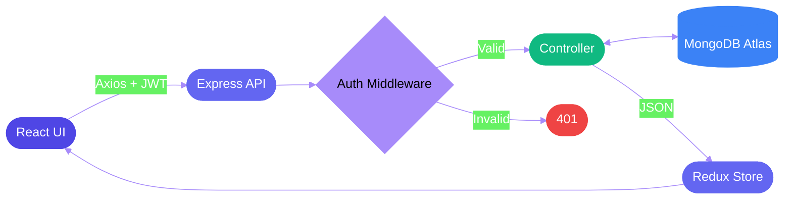

<div align="center">


<br>

<a href="https://safar-sathii.netlify.app">
  
</a>
&nbsp;&nbsp;

&nbsp;&nbsp;

&nbsp;&nbsp;


<br><br>


</div>

<br>

> **SafarSathi** is a full-stack travel itinerary and budget management platform. It lets users plan trips day-by-day, track expenses with visual charts, and share itineraries publicly — all from one unified dashboard. Built with React, Redux Toolkit, Node.js, Express, and MongoDB Atlas.

<br>

<div align="center">

### What Makes SafarSathi Different

</div>

<table>
<tr>
<td width="50%">

**Day-wise Itinerary Builder** — Plan each day with activities, time slots, categories, locations, and per-item costs

**Real-time Budget Tracker** — Log expenses by category. Visual progress bar triggers alerts when over budget

**Recharts Donut Chart** — Category-wise spending breakdown at a glance — food, hotel, transport, activities

</td>
<td width="50%">

**Public Trip Sharing** — Generate a read-only link. Anyone can view itinerary and budget without logging in

**Smart Search + Filter** — 500ms debounced search, status filters, 4 sort modes, paginated at 6 per page

**JWT Auth + Dark Mode** — Secure token-based auth on all routes. Full dark/light theme with persistence

</td>
</tr>
</table>

<br>

<div align="center">

</div>

<br>

<div align="center">

### Tech Stack

<br>

**Frontend**


React 18 &nbsp;|&nbsp; Vite &nbsp;|&nbsp; Redux Toolkit &nbsp;|&nbsp; React Router v6 &nbsp;|&nbsp; Tailwind CSS v3 &nbsp;|&nbsp; Recharts &nbsp;|&nbsp; Axios

<br>

**Backend**


Node.js &nbsp;|&nbsp; Express &nbsp;|&nbsp; MongoDB + Mongoose &nbsp;|&nbsp; JWT &nbsp;|&nbsp; dotenv

<br><br>


</div>

<br>

<div align="center">

### Architecture


```mermaid
%%{init: {'theme':'base','themeVariables':{'primaryColor':'#6366F1','primaryTextColor':'#fff','lineColor':'#a78bfa','background':'#0f172a'}}}%%
flowchart LR
    A([React UI]) -->|Axios + JWT| B([Express API])
    B --> C{Auth Middleware}
    C -->|Valid| D([Controller])
    C -->|Invalid| E([401])
    D <--> F[(MongoDB Atlas)]
    D -->|JSON| G([Redux Store])
    G --> A

    style A fill:#4f46e5,stroke:#4f46e5,color:#fff
    style B fill:#6366F1,stroke:#6366F1,color:#fff
    style C fill:#a78bfa,stroke:#a78bfa,color:#000
    style D fill:#10B981,stroke:#10B981,color:#fff
    style E fill:#EF4444,stroke:#EF4444,color:#fff
    style F fill:#3b82f6,stroke:#3b82f6,color:#fff
    style G fill:#6366F1,stroke:#6366F1,color:#fff
```

</div>

<br>

<div align="center">

</div>

<br>

### Quick Start

```bash
# Clone
git clone https://github.com/mananjani2102/safarsathi.git && cd safarsathi

# Backend
cd backend && npm install
# Create .env with: PORT, MONGO_URI, JWT_SECRET, NODE_ENV
npm run dev    # http://localhost:5000

# Frontend
cd ../frontend && npm install
# Create .env with: VITE_API_URL=http://localhost:5000/api
npm run dev    # http://localhost:3000
```

<details>
<summary><strong>Environment Variables</strong></summary>

<br>

**Backend `.env`**

| Variable | Description |
|:---------|:------------|
| `PORT` | Express server port |
| `MONGO_URI` | MongoDB Atlas connection string |
| `JWT_SECRET` | Secret for signing JWT tokens |
| `NODE_ENV` | `development` or `production` |

**Frontend `.env`**

| Variable | Description |
|:---------|:------------|
| `VITE_API_URL` | Backend API base URL (ending in `/api`) |

</details>

<br>

<div align="center">

</div>

<br>

<details>
<summary><strong>API Reference</strong></summary>

<br>

Base URL: `https://safarsathi-backend-0ndc.onrender.com/api`

| Method | Endpoint | Description | Auth |
|:------:|:---------|:------------|:----:|
| `POST` | `/auth/register` | Register new user | No |
| `POST` | `/auth/login` | Login, receive JWT | No |
| `GET` | `/auth/profile` | Get user profile | Yes |
| `GET` | `/trips` | List trips (search, filter, sort, paginate) | Yes |
| `POST` | `/trips` | Create trip | Yes |
| `GET/PUT/DELETE` | `/trips/:id` | Read / Update / Delete trip | Yes |
| `GET` | `/activities/:tripId` | Get activities for trip | Yes |
| `POST/PUT/DELETE` | `/activities/:id` | Create / Update / Delete activity | Yes |
| `GET` | `/expenses/:tripId` | Get expenses for trip | Yes |
| `POST/PUT/DELETE` | `/expenses/:id` | Create / Update / Delete expense | Yes |
| `GET` | `/public/trip/:id` | Public read-only trip view | No |

**GET `/trips` Query Params:** `search`, `status` (upcoming/ongoing/completed), `sort` (newest/oldest/budget_high/budget_low), `page`, `limit`

</details>

<br>

<details>
<summary><strong>Project Structure</strong></summary>

<br>

```
safarsathi/
+-- backend/
|   +-- config/db.js              <- MongoDB connection
|   +-- controllers/              <- auth, trip, activity, expense, public
|   +-- middleware/               <- JWT auth + error handling
|   +-- models/                   <- User, Trip, Activity, Expense
|   +-- routes/                   <- Modular route files
|   +-- server.js
|
+-- frontend/src/
    +-- components/               <- Navbar, TripCard, BudgetChart, Pagination, etc.
    +-- pages/                    <- Home, Login, Register, Dashboard, Trips, TripDetails
    +-- redux/                    <- store + slices (auth, trip, activity, expense)
    +-- services/api.js           <- Axios + JWT interceptor
    +-- context/ThemeContext.jsx   <- Dark/light mode
    +-- hooks/useDebounce.js      <- 500ms search debounce
```

</details>

<br>

<details>
<summary><strong>Deployment</strong></summary>

<br>

| Service | Platform | Setup |
|:--------|:---------|:------|
| **Frontend** | Netlify | Base: `frontend`, Build: `npm run build`, Publish: `frontend/dist` |
| **Backend** | Render | Root: `backend`, Build: `npm install`, Start: `node server.js` |
| **Database** | MongoDB Atlas | Free M0 cluster, whitelist `0.0.0.0/0` for Render |

Live: [safar-sathii.netlify.app](https://safar-sathii.netlify.app)

</details>

<br>

<div align="center">

</div>

<br>

### Roadmap

| Priority | Feature |
|:--------:|:--------|
| High | In-line trip and activity editing |
| High | Export itinerary as PDF |
| Medium | Google Maps integration per activity |
| Medium | Collaborative trip planning |

<br>

### Contributing

Fork, branch (`feature/your-feature`), commit, and open a PR to `main`. Follow existing controller patterns with proper error handling.

### License

[MIT](LICENSE)

<br>

<div align="center">


<br>

Built by **Manan Jani** for the Full Stack Hackathon — CodingGita

<br>


</div>
